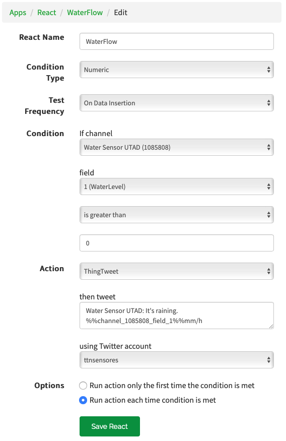

# Water Sensor and Flow Meter

> Para mais fácil leitura deste ficheiro, usar o vscode (ou similar) e colocar em modo "preview".

Este projeto foi desenvolvido no ambito:

__Cadeira:__ `Intrumentação e Sensores`

__Curso:__ [`Mestrado Integrado Engenharia Eletrotécnica e de Computadores`](https://www.utad.pt/estudar/cursos/engenharia-eletrotecnica-e-de-computadores/)

__Universidade:__

<div style="width:250px;">

[](https://www.utad.pt)

</div>

## Introdução

Pretende-se com este projeto estudar o que são sensores, e também, o que vem a ser o protocolo LoRa. Para tal, vamos simular uma situação real onde se visa saber o caudal de água que passa num determinado caleiro.

Para realizar essa tarefa vamos usar:

- Medir o caudal
  - [Arduino MKR Wan 1310]( https://store.arduino.cc/mkr-wan-1310)
  - Um sensor improvisado (pretendia-se desenvolver uma solução real, mas devido ao Covid-19 essa tarefa ficou adiada)
- Para armazenar e apresentar os dados
  - [ThingsSpeak]( https://thingspeak.com)
  - [Twitter - @TTNSensores_UTAD]( https://twitter.com/ttnsensores) – usado para emitir “alertas”
- Para realizar a interligação entre o sensor e a “base de dados”
  - Protocolo de comunicação `LoRa`
  - LoRaWan network: [The Things Network]( https://www.thethingsnetwork.org/)

## Realização do projeto

Este projeto foi realizado em 4 partes, sendo elas:

- Obter o EUI da Placa e registo da mesma na plataforma _The Things Network_.
- Realizar as Medições
- Enviar os dados obtidos para a plataforma _The Things Network_.
- Integração do _The Things Network_ com o _ThingsSpeak_.

## Obter o EUI e registo da placa no _The Things Network_

### Obter EUI

O código necessário para essa tarefa encontra-se na pasta `get_eui`.

```plan
Your device EUI is: A8610A3337XXXXXX
```

### Register Devices

__Procedimento:__

- Entrar em `Applications` e selecionar a aplicação pertendida.
- Em `Devices` clique em `register device`
- Preencher os campos da figura abaixo:

<div style="width:550px;">


</div>

```plan
Application ID: water_sensor_utad
Device EUI: A8610A3337XXXXXX
```

__Resultado:__

```js
const char *appEui = "70B3D57ED0XXXXXX";
const char *appKey = "6935F074F3ADB47783E5FB0DCAXXXXXX";
```

## Medições

O código encontra-se nos ficheiros `water_sensor_utad.ino` e `arduino_secrets.h`

### Obter valor

Apresentação das partes mais importantes do código e uma breve explicação de cada uma.

```c

  // Ler o valor da tensão
  voltage = analogRead(A0);

  // Se a tensão for maior que 1 volt, conta uma gota
  if (voltage > 210) drops++;

  // Média de gotas por minuto (60000ms) - Valor máximo previsto: 1200 gotas
  if (millis() - time > 60000)
  {
    dropvalue = (float)drops * 0.6 + (float)dropvalue * 0.4;
    drops = 0;
    time = millis();
  }
```

## Enviar os dados para o _The Things Network_

### Enviar dados

O código encontra-se nos ficheiros `water_sensor_utad.ino` e `arduino_secrets.h`

```c
  // Enviar valores para "the network of things" de hora em hora (360000ms)
  if (millis() - timeUpload > 360000)
  {

    // Tratamento de dados
    int aux = (int)(dropvalue + 0.55);
    txBuffer[0] = (aux >> 8) & 0xff;
    txBuffer[1] = aux & 0xff;

    // Envio de dados
    int err;
    modem.beginPacket();
    modem.write(txBuffer);
    err = modem.endPacket(true);

    // Redefinir temporizador
    timeUpload = millis();
  }
```

### Payload

__Procedimento:__

- Selecionar o projeto em causa no _The Things Network_
- Selecionar `Payload Formats` e editar a função `Decoder`

#### Função Decode

```js
function Decoder(bytes, port) {
  var decoded = {};
  
  var dropSize = 2.25 //mm
  var timeScale = 60 //60 min
  
  if (port === 1) decoded.water = (((bytes[0] << 8) | bytes[1]) * dropSize * timeScale).toFixed(2);

  return {
    field1:decoded.water
  }
}
```

#### Teste do Payload

__Valor para teste:__

_Drops:_ 1192

```plan
04 A8
```

__Resultado:__

_Valor previsto:_ 1192 x 60 x 2.25 = 160920

```json
{
  "field1": "160920.00"
}
```

## Integração do _ThingsSpeak_ com _The Things Network_ e com o _Twitter_

### ThingsSpeak

__Procedimento:__

- Selecionar `Channels` e depois `New Channel`
- Preencher os campos.

```plain
Name: Water Sensor UTAD
Description: water sensor and flow meter
Field 1: WaterLevel
Link to GitHub: https://github.com/Sebenta/water-sensor-utad
```

- Clique em `Save Channel`

__Channel ID:__ 1085808

[Water Sensor UTAD - ThingSpeak IoT](https://thingspeak.com/channels/1085808)

#### API Keys

__Write API KEY:__

```plain
Key: EVVRG8TEY9XXXXXX
```

__Read API Keys:__

```plain
Key: QKWXDLD852XXXXXX
```

### Integrar o _The Things Network_ com o _ThingsSpeak_

- No _The Things Network_ selcionar o projeto
- Selecionar `Integrations` e de pois `add integration`
- Selecionar integração com _ThingsSpeak IoT Analytics with MATLAB_
- Preencher os campos


</div>

- Clicar em `Add integration`

### Testar integração

__No _The Things Network_ :__

Para testar a integração:

- Selecionar um `device`
- fazer _scroll_ até `Simulate Uplink`
- intrduzir valores para teste e clicar em `Send`

__No _ThingsSpeak_ :__

- Selecionar o `Channels` correspondente
- Verificar se os valores testados aparecem no gráfico


### Integração do _ThingsSpeak_ com o _Twitter_

#### Twitter

Criar conta caso não tenha.

Conta: [TTNSensores_UTAD  - @ttnsensores](https://twitter.com/ttnsensores)

#### No _ThingsSpeak_

__Procedimento:__

- no separador `Apps` selecionar `ThingTweet`
- Clicar em `Link Twitter Account`
- Clicar em `Autorize app`
- Em `Apps` seleccione a opção `React` e depois `New React`
- Preencher os campos

<div style="width:550px;">



</div>

- Clicar e Save React

## Notas sobre o trabalho

Ficou a faltar o sensor (por motivos externos ao grupo) e consequentemente a calibração do mesmo.

A logica usada para obter os valores precisa de melhorias. Uma alteração que deve ser levada em conta, é a alteração do local onde é inserida o valor da "calibração" (que nesta fase encontra-se no _payload_) colocando-a no código que corre no Arduino.

Faltou também testar no terreno.

Se no futuro voltarmos a pegar neste projeto, todas alterações vão constar no repositorio do github [Water sensor utad](https://github.com/Sebenta/water-sensor-utad).


## Este Trabalho foi realizador por

- 22653 Eduardo Queirós
- 66509 Hugo Claro
